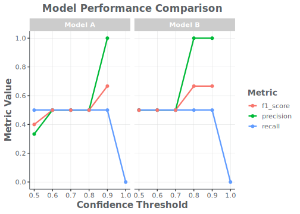
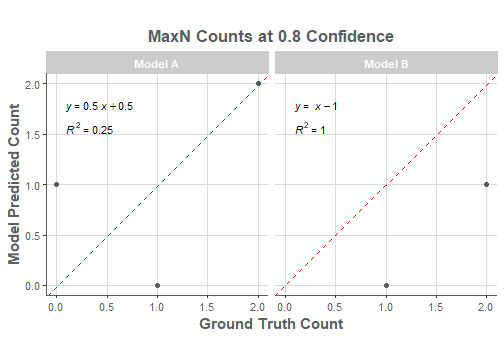

## 1. Introduction

The `Optics` package provides a standardized toolkit for evaluating the performance of machine learning models on optical survey data. This vignette demonstrates a current workflow using bundled example data, from ingesting raw model output to generating final performance metrics and visualizations.

<div class="vehicle-icons"></div>

First, let's load the `Optics` package and other useful libraries like `dplyr`.


```r
library(Optics)
library(dplyr)
#> 
#> Attaching package: 'dplyr'
#> The following objects are masked from 'package:stats':
#> 
#>     filter, lag
#> The following objects are masked from 'package:base':
#> 
#>     intersect, setdiff, setequal, union
library(ggplot2)
```

## 2. Loading Packaged Example Data

For this example, we will use the bundled AKFSC ice seal files so the homepage reflects the current package workflows. This gives us a realistic walkthrough of data ingestion, candidate selection, threshold summaries, and visualization using the same helper functions that support the full package vignettes and reports.


```r
extdata_dir <- system.file("extdata/AKFSC", package = "Optics")
if (extdata_dir == "") {
  extdata_dir <- file.path("inst", "extdata", "AKFSC")
}

model_files <- list.files(extdata_dir, pattern = "_ir_detections\\.csv$", full.names = TRUE)
truth_files <- list.files(extdata_dir, pattern = "_validated\\.csv$", full.names = TRUE)

camera_from_path <- function(path) {
  stringr::str_match(basename(path), "_([LCR])_")[, 2]
}

camera_file_map <- dplyr::inner_join(
  tibble::tibble(model_file = model_files, camera = camera_from_path(model_files)),
  tibble::tibble(truth_file = truth_files, camera = camera_from_path(truth_files)),
  by = "camera"
) %>%
  arrange(camera)

model_detections <- ingest_ice_seals_csv(camera_file_map$model_file)
truth_detections <- ingest_ice_seals_csv(camera_file_map$truth_file)

truth_file_map <- setNames(camera_file_map$truth_file, camera_file_map$camera)
truth_totals <- calculate_ice_seals_totals(
  left_file = truth_file_map[["L"]],
  center_file = truth_file_map[["C"]],
  right_file = truth_file_map[["R"]]
)

candidate_detections <- select_ice_seals_candidates(
  model_detections,
  score_threshold = 0.7,
  candidate_class = "hotspot"
)

print(truth_totals)
#> $left
#> [1] 121
#> 
#> $center
#> [1] 78
#> 
#> $right
#> [1] 105

candidate_detections %>%
  select(image_id, frame_index, category_name, score) %>%
  head()
#>                                                                                                                                                     image_id
#> 1 \\\\akc0ss-n086\\NMML_Polar_Imagery_4\\Surveys_IceSeals_2025\\fl223\\images_30deg_N68RF\\center_view\\ice_seals_2025_fl223_C_20250513_223137.115060_ir.tif
#> 2 \\\\akc0ss-n086\\NMML_Polar_Imagery_4\\Surveys_IceSeals_2025\\fl223\\images_30deg_N68RF\\center_view\\ice_seals_2025_fl223_C_20250513_223646.824115_ir.tif
#> 3 \\\\akc0ss-n086\\NMML_Polar_Imagery_4\\Surveys_IceSeals_2025\\fl223\\images_30deg_N68RF\\center_view\\ice_seals_2025_fl223_C_20250513_225201.625272_ir.tif
#> 4 \\\\akc0ss-n086\\NMML_Polar_Imagery_4\\Surveys_IceSeals_2025\\fl223\\images_30deg_N68RF\\center_view\\ice_seals_2025_fl223_C_20250513_225746.545744_ir.tif
#> 5 \\\\akc0ss-n086\\NMML_Polar_Imagery_4\\Surveys_IceSeals_2025\\fl223\\images_30deg_N68RF\\center_view\\ice_seals_2025_fl223_C_20250513_225747.614950_ir.tif
#> 6 \\\\akc0ss-n086\\NMML_Polar_Imagery_4\\Surveys_IceSeals_2025\\fl223\\images_30deg_N68RF\\center_view\\ice_seals_2025_fl223_C_20250513_231236.053040_ir.tif
#>   frame_index category_name   score
#> 1         130       hotspot 0.71061
#> 2         398       hotspot 0.70879
#> 3        1145       hotspot 0.71065
#> 4        1462       hotspot 0.77292
#> 5        1463       hotspot 0.72416
#> 6        2253       hotspot 0.73261
```

## 3. Optional: Build a GCP Media URI Index

When your workflow inputs are stored in Google Cloud Storage, `scrape_gcp_uris()` can build a simple media index for downstream ingestion. This keeps bucket listing logic centralized and returns a consistent three-column lookup table (`folder_name`, `file_name`, `bucket_uri`).

```r
gcp_media_index <- scrape_gcp_uris(
  bucket_name = "nmfs-dev-uc1-sefsc",
  prefix = "GFISHER/Video_data/",
  extensions = c(".mp4", ".avi", ".jpg")
)

head(gcp_media_index)
```

## 4. Summarizing Performance by Threshold

A key task is to evaluate how a model performs at different confidence thresholds. For a compact homepage example, we'll create small in-memory detection tables, convert them to `OpticsDetections` objects, and summarize performance across thresholds with `summarize_performance_by_threshold()`.


```r
# Sample model detections with scores
model_detections_df <- tibble(
  video_id = "vid01",
  image_id = "img01",
  annotation_id = 1:8,
  category_name = c("Gadus morhua", "Gadus morhua", "Melanogrammus aeglefinus", "Gadus morhua", "Pollachius virens", "Gadus morhua", "Melanogrammus aeglefinus", "Melanogrammus aeglefinus"),
  score = c(0.95, 0.85, 0.80, 0.65, 0.50, 0.92, 0.75, 0.60),
  frame_index = c(10, 10, 15, 20, 20, 10, 15, 15),
  model_name = c(rep("Model A", 5), rep("Model B", 3)),
  bbox_x = 0, bbox_y = 0, bbox_width = 1, bbox_height = 1
)

# Sample ground truth detections
truth_detections_df <- tibble(
  video_id = "vid01",
  image_id = "img01",
  annotation_id = 9:12,
  category_name = c("Gadus morhua", "Gadus morhua", "Gadus morhua", "Urophycis tenuis"),
  frame_index = c(10, 10, 20, 30),
  score = 1.0,
  bbox_x = 0, bbox_y = 0, bbox_width = 1, bbox_height = 1
)

thresholds_to_test <- seq(0.5, 1.0, by = 0.1)

model_a <- OpticsDetections(
  data = filter(model_detections_df, model_name == "Model A"),
  source_file = "manual",
  ingest_format = "manual"
)
model_b <- OpticsDetections(
  data = filter(model_detections_df, model_name == "Model B"),
  source_file = "manual",
  ingest_format = "manual"
)
truth <- OpticsDetections(
  data = truth_detections_df,
  source_file = "manual",
  ingest_format = "manual"
)

perf_model_a <- summarize_performance_by_threshold(
  model_detections = model_a,
  truth_detections = truth,
  by = c("video_id", "category_name"),
  thresholds = thresholds_to_test
) %>% mutate(model_name = "Model A")

perf_model_b <- summarize_performance_by_threshold(
  model_detections = model_b,
  truth_detections = truth,
  by = c("video_id", "category_name"),
  thresholds = thresholds_to_test
) %>% mutate(model_name = "Model B")

performance_summary <- bind_rows(perf_model_a, perf_model_b)

performance_summary %>%
  select(model_name, threshold, precision, recall, f1_score) %>%
  arrange(model_name, threshold)
#> # A tibble: 12 × 5
#>    model_name threshold precision recall f1_score
#>    <chr>          <dbl>     <dbl>  <dbl>    <dbl>
#>  1 Model A          0.5     0.333    0.5    0.4  
#>  2 Model A          0.6     0.5      0.5    0.5  
#>  3 Model A          0.7     0.5      0.5    0.5  
#>  4 Model A          0.8     0.5      0.5    0.5  
#>  5 Model A          0.9     1        0.5    0.667
#>  6 Model A          1      NA        0     NA    
#>  7 Model B          0.5     0.5      0.5    0.5  
#>  8 Model B          0.6     0.5      0.5    0.5  
#>  9 Model B          0.7     0.5      0.5    0.5  
#> 10 Model B          0.8     1        0.5    0.667
#> 11 Model B          0.9     1        0.5    0.667
#> 12 Model B          1      NA        0     NA
```

## 5. Visualizing Performance

With the summary data, we can now create plots to compare the model views. The plotting functions are now S4 generics and work directly with the current threshold-summary output.

### Performance by Threshold Plot

The `plot_performance_by_threshold()` function visualizes the trade-offs between precision, recall, and F1-score.


```r
plot_performance_by_threshold(
  performance_summary,
  model_col = model_name,
  title = "Model Performance Comparison"
)
#> Warning: Removed 2 rows containing missing values (`geom_line()`).
#> Warning: Removed 4 rows containing missing values (`geom_point()`).
```



### Count Comparison Scatterplot

To see how well the model counts match the truth counts at a specific threshold, we can generate a scatterplot. The `calculate_maxn()` generic works on both `OpticsDetections` objects and standard `data.frame`s.


```r
model_counts_at_08 <- model_detections_df %>%
  filter(score >= 0.8) %>%
  calculate_maxn(group_cols = "model_name")

truth_counts <- calculate_maxn(truth_detections_df)

aligned_a <- align_counts(
  model_counts = filter(model_counts_at_08, model_name == "Model A"),
  truth_counts = truth_counts,
  by = c("video_id", "category_name")
) %>% mutate(model_name = "Model A")

aligned_b <- align_counts(
  model_counts = filter(model_counts_at_08, model_name == "Model B"),
  truth_counts = truth_counts,
  by = c("video_id", "category_name")
) %>% mutate(model_name = "Model B")

aligned_counts <- bind_rows(aligned_a, aligned_b)

plot_counts_scatterplot(
  aligned_counts,
  model_col = model_name,
  title = "MaxN Counts at 0.8 Confidence"
)
```



This vignette provides a basic overview of the current package workflow. The `Optics` package also includes helpers for Ice Seal review preparation (`ingest_ice_seals_csv()`, `calculate_ice_seals_totals()`, `select_ice_seals_candidates()`), legacy GFISHER reporting (`calculate_legacy_metrics()`, `calculate_percent_metric()`), and more in-depth analyses such as ROC curves, confusion matrices, and reviewer-effort summaries.
