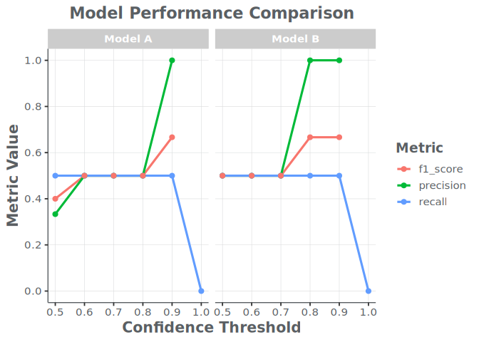

Introduction to the Optics Package
================

## 1. Introduction

The `Optics` package provides a standardized toolkit for evaluating the
performance of machine learning models on optical survey data. This
vignette demonstrates a complete workflow, from ingesting raw model
output to generating final performance metrics and visualizations.

<div class="vehicle-icons">


</div>

First, let’s load the `Optics` package and other useful libraries like
`dplyr`.

``` r
library(Optics)
library(dplyr)
#> 
#> Attaching package: 'dplyr'
#> The following objects are masked from 'package:stats':
#> 
#>     filter, lag
#> The following objects are masked from 'package:base':
#> 
#>     intersect, setdiff, setequal, union
library(ggplot2)
```

## 2. Creating Sample Data

For this example, we will create sample data representing raw model
detections and a corresponding ground truth dataset. In a real workflow,
this data would be ingested using `read_kwcoco()` or `read_viame_csv()`,
which return `OpticsDetections` S4 objects.

For this vignette, we’ll construct the data frames manually and then
create the S4 objects. Note that the `OpticsDetections` class requires a
specific set of columns.

``` r
# Sample model detections with scores
model_detections_df <- tibble(
  video_id = "vid01",
  image_id = "img01",
  annotation_id = 1:8,
  category_name = c("Gadus morhua", "Gadus morhua", "Melanogrammus aeglefinus", "Gadus morhua", "Pollachius virens", "Gadus morhua", "Melanogrammus aeglefinus", "Melanogrammus aeglefinus"),
  score = c(0.95, 0.85, 0.80, 0.65, 0.50, 0.92, 0.75, 0.60),
  frame_index = c(10, 10, 15, 20, 20, 10, 15, 15),
  model_name = c(rep("Model A", 5), rep("Model B", 3)),
  bbox_x = 0, bbox_y = 0, bbox_width = 1, bbox_height = 1 # Dummy columns for validation
)

# Sample ground truth detections (no scores)
truth_detections_df <- tibble(
  video_id = "vid01",
  image_id = "img01",
  annotation_id = 9:12,
  category_name = c("Gadus morhua", "Gadus morhua", "Gadus morhua", "Urophycis tenuis"),
  frame_index = c(10, 10, 20, 30),
  score = 1.0, # Dummy score for validation
  bbox_x = 0, bbox_y = 0, bbox_width = 1, bbox_height = 1 # Dummy columns for validation
)

print("Model Detections:")
#> [1] "Model Detections:"
print(model_detections_df)
#> # A tibble: 8 x 11
#>   video_id image_id annotation_id category_name     score frame_index model_name
#>   <chr>    <chr>            <int> <chr>             <dbl>       <dbl> <chr>     
#> 1 vid01    img01                1 Gadus morhua       0.95          10 Model A   
#> 2 vid01    img01                2 Gadus morhua       0.85          10 Model A   
#> 3 vid01    img01                3 Melanogrammus ae~  0.8           15 Model A   
#> 4 vid01    img01                4 Gadus morhua       0.65          20 Model A   
#> 5 vid01    img01                5 Pollachius virens  0.5           20 Model A   
#> 6 vid01    img01                6 Gadus morhua       0.92          10 Model B   
#> 7 vid01    img01                7 Melanogrammus ae~  0.75          15 Model B   
#> 8 vid01    img01                8 Melanogrammus ae~  0.6           15 Model B   
#> # i 4 more variables: bbox_x <dbl>, bbox_y <dbl>, bbox_width <dbl>,
#> #   bbox_height <dbl>

print("Truth Detections:")
#> [1] "Truth Detections:"
print(truth_detections_df)
#> # A tibble: 4 x 10
#>   video_id image_id annotation_id category_name  frame_index score bbox_x bbox_y
#>   <chr>    <chr>            <int> <chr>                <dbl> <dbl>  <dbl>  <dbl>
#> 1 vid01    img01                9 Gadus morhua            10     1      0      0
#> 2 vid01    img01               10 Gadus morhua            10     1      0      0
#> 3 vid01    img01               11 Gadus morhua            20     1      0      0
#> 4 vid01    img01               12 Urophycis ten~          30     1      0      0
#> # i 2 more variables: bbox_width <dbl>, bbox_height <dbl>
```

## 3. Summarizing Performance by Threshold

A key task is to evaluate how a model performs at different confidence
thresholds. The `summarize_performance_by_threshold()` function
automates this. It now operates on `OpticsDetections` S4 objects.

``` r
# Define the thresholds we want to test
thresholds_to_test <- seq(0.5, 1.0, by = 0.1)

# Create OpticsDetections objects for each model and for the truth data
model_a_obj <- OpticsDetections(
  data = filter(model_detections_df, model_name == "Model A"),
  source_file = "manual", ingest_format = "manual"
)
model_b_obj <- OpticsDetections(
  data = filter(model_detections_df, model_name == "Model B"),
  source_file = "manual", ingest_format = "manual"
)
truth_obj <- OpticsDetections(
  data = truth_detections_df,
  source_file = "manual", ingest_format = "manual"
)

# Analyze Model A
perf_model_a <- summarize_performance_by_threshold(
  model_detections = model_a_obj,
  truth_detections = truth_obj,
  by = c("video_id", "category_name"),
  thresholds = thresholds_to_test
) %>% mutate(model_name = "Model A")

# Analyze Model B
perf_model_b <- summarize_performance_by_threshold(
  model_detections = model_b_obj,
  truth_detections = truth_obj,
  by = c("video_id", "category_name"),
  thresholds = thresholds_to_test
) %>% mutate(model_name = "Model B")

# Combine into a single data frame
performance_summary <- bind_rows(perf_model_a, perf_model_b)

print(performance_summary)
#> # A tibble: 12 x 17
#>       tp    fp    fn precision recall f1_score    tn accuracy   fpr   fnr
#>    <dbl> <dbl> <int>     <dbl>  <dbl>    <dbl> <int>    <dbl> <dbl> <dbl>
#>  1     1     2     1     0.333    0.5    0.4       0    0.25    1     0.5
#>  2     1     1     1     0.5      0.5    0.5       1    0.5     0.5   0.5
#>  3     1     1     1     0.5      0.5    0.5       1    0.5     0.5   0.5
#>  4     1     1     1     0.5      0.5    0.5       1    0.5     0.5   0.5
#>  5     1     0     1     1        0.5    0.667     2    0.75    0     0.5
#>  6     0     0     2    NA        0     NA        NA   NA      NA    NA  
#>  7     1     1     1     0.5      0.5    0.5       0    0.333   1     0.5
#>  8     1     1     1     0.5      0.5    0.5       0    0.333   1     0.5
#>  9     1     1     1     0.5      0.5    0.5       0    0.333   1     0.5
#> 10     1     0     1     1        0.5    0.667     1    0.667   0     0.5
#> 11     1     0     1     1        0.5    0.667     1    0.667   0     0.5
#> 12     0     0     2    NA        0     NA        NA   NA      NA    NA  
#> # i 7 more variables: false_positive_ratio <dbl>, false_negative_ratio <dbl>,
#> #   mcc_num <dbl>, mcc_den <dbl>, mcc <dbl>, threshold <dbl>, model_name <chr>
```

## 4. Visualizing Performance

With the summary data, we can now create plots to compare the models.
The plotting functions are now S4 generics.

### Performance by Threshold Plot

The `plot_performance_by_threshold()` function visualizes the trade-offs
between precision, recall, and F1-score.

``` r
plot_performance_by_threshold(
  performance_summary,
  model_col = model_name,
  title = "Model Performance Comparison"
)
#> Warning: Removed 4 rows containing missing values or values outside the scale range
#> (`geom_line()`).
#> Warning: Removed 4 rows containing missing values or values outside the scale range
#> (`geom_point()`).
```

<figure>

<figcaption aria-hidden="true">Precision, Recall, and F1-Score for Model
A and Model B across different confidence thresholds.</figcaption>
</figure>

### Count Comparison Scatterplot

To see how well the model counts match the truth counts at a *specific*
threshold (e.g., 0.8), we can generate a scatterplot. The
`calculate_maxn` generic works on both `OpticsDetections` objects and
standard `data.frame`s.

``` r
# We can still use standard dplyr pipes. The calculate_maxn S4 generic will
# dispatch the correct method for a data.frame.
model_counts_at_08 <- model_detections_df %>%
  filter(score >= 0.8) %>%
  calculate_maxn(group_cols = "model_name")

truth_counts <- calculate_maxn(truth_detections_df)

# Align each model's counts to the truth separately
aligned_a <- align_counts(
  model_counts = filter(model_counts_at_08, model_name == "Model A"),
  truth_counts = truth_counts,
  by = c("video_id", "category_name")
) %>% mutate(model_name = "Model A")

aligned_b <- align_counts(
  model_counts = filter(model_counts_at_08, model_name == "Model B"),
  truth_counts = truth_counts,
  by = c("video_id", "category_name")
) %>% mutate(model_name = "Model B")

aligned_counts <- bind_rows(aligned_a, aligned_b)

# Generate the plot
plot_counts_scatterplot(
  aligned_counts,
  model_col = model_name,
  title = "MaxN Counts at 0.8 Confidence"
)
```

<figure>

<figcaption aria-hidden="true">Model vs. Truth MaxN counts at a 0.8
confidence threshold.</figcaption>
</figure>

This vignette provides a basic overview of a standard workflow. The
`Optics` package contains many other S4 methods for more in-depth
analysis, including generating ROC curves, confusion matrices, and
analyzing the drivers of model error.
